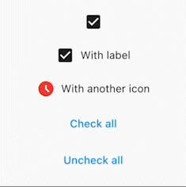

<!-- 
This README describes the package. If you publish this package to pub.dev,
this README's contents appear on the landing page for your package.

For information about how to write a good package README, see the guide for
[writing package pages](https://dart.dev/guides/libraries/writing-package-pages). 

For general information about developing packages, see the Dart guide for
[creating packages](https://dart.dev/guides/libraries/create-library-packages)
and the Flutter guide for
[developing packages and plugins](https://flutter.dev/developing-packages). 
-->

<!-- TODO: Put a short description of the package here that helps potential users
know whether this package might be useful for them. -->

## Features

Package created to give a fully functional and customizable CheckBox.

## Getting started



## Usage

The most simple use is this one. A prepared checkbox that has a callback when selected/unselected.

```dart
OneCheckbox(
    onChanged: (isChecked) {},
)
```

## Customize to your needs  
You can customize all sort of behaviors and look you want. You can do things like change selected/unselected color, selected/unselected  
widgets, etc.

```dart
Center(
    child: Column(
        mainAxisAlignment: MainAxisAlignment.center,
        children: [
        OneCheckbox(
            controller: _checkboxAController,
        ),
        OneCheckbox(
            label: const Text('With label'),
            controller: _checkboxBController,
        ),
        OneCheckbox(
            label: const Text('With another icon'),
            checkedIcon: const Icon(Icons.access_time_filled, color: Colors.red),
            uncheckIcon: const Icon(Icons.access_time, color: Colors.green),
            controller: _checkboxCController,
        ),
        TextButton(
            onPressed: () {
            _checkboxAController.isChecked = true;
            _checkboxBController.isChecked = true;
            _checkboxCController.isChecked = true;
            },
            child: const Text('Check all'),
        ),
        TextButton(
            onPressed: () {
            _checkboxAController.isChecked = false;
            _checkboxBController.isChecked = false;
            _checkboxCController.isChecked = false;
            },
            child: const Text('Uncheck all'),
        ),
        ],
    ),
)
```